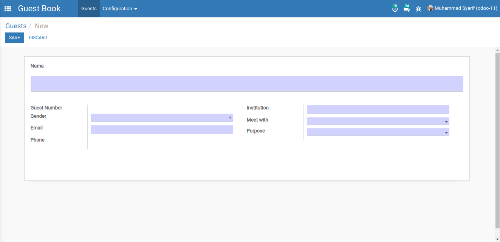
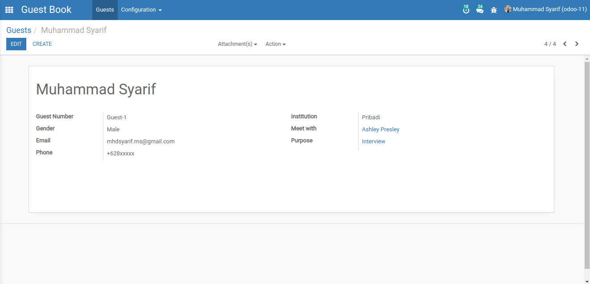
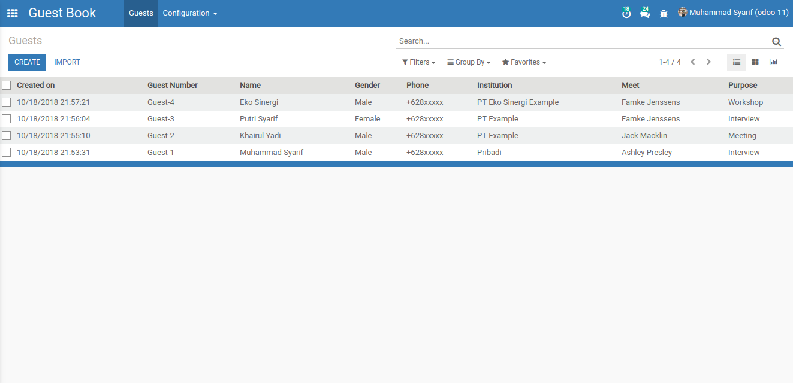
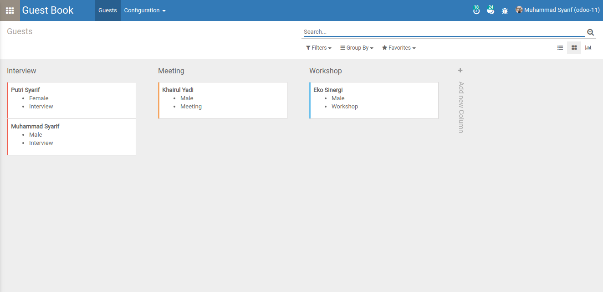
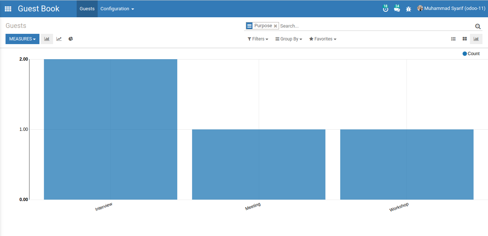
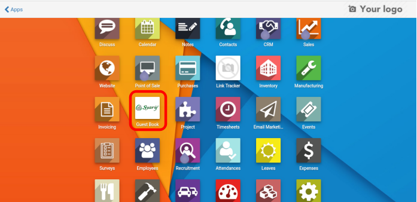
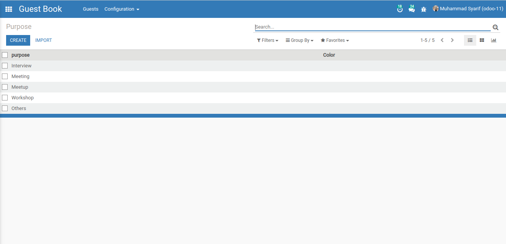
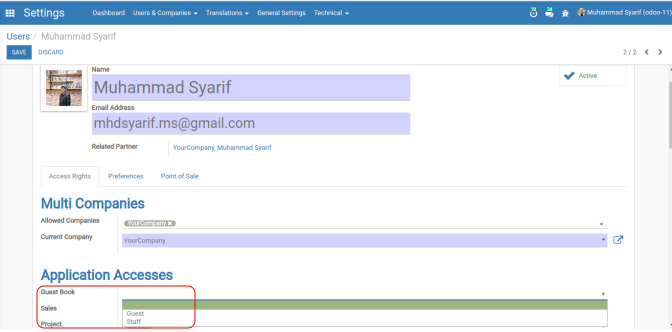
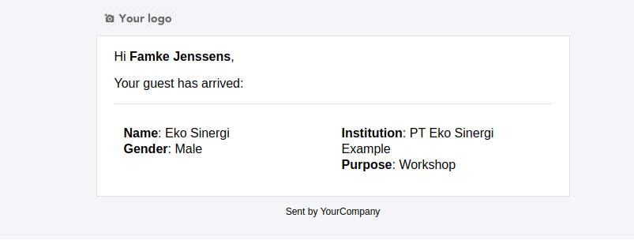

# Guest Book System
Check in Guest Book System

# Form

# View Guest

# List View Guests

# Kanban Guests

# Graph Guests

# Icon Apps

# Configuration Purpose

# Usage

Install module

Group users

    <ul>
        <li><strong>Guest</strong> (Input Guest)</li>
        <li><strong>Staff</strong> (Configuration)</strong></li>
    </ul>

After entering the data by the guest, the system will send an email to the employee that is met

# Issue

<a href="https://github.com/mhdsyarif/odoo-addons/issues">https://github.com/mhdsyarif/odoo-addons/issues</a>
